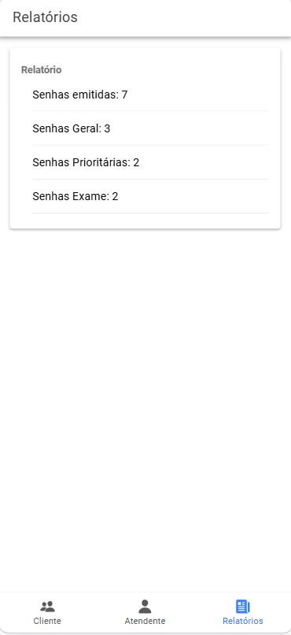

# MobileTicketsIonic

> Sistema de controle de atendimento em filas de laboratórios médicos — desenvolvido com **Ionic + Angular**.

---

## Sobre o Projeto

O **MobileTicketsIonic** é um aplicativo mobile desenvolvido como projeto da disciplina de **Desenvolvimento Para Dispositivos Móveis** no Centro Universitário Maurício de Nassau (UNINASSAU), sob orientação do Professor João Ferreira.

O sistema simula um **gerenciador de tickets de atendimento** para laboratórios médicos, permitindo a emissão de senhas por tipo de prioridade e o acompanhamento em tempo real dos atendimentos.

---

## Requisitos do Sistema

O sistema trabalha com **3 agentes**:

| Agente | Papel |
|--------|-------|
| **AS** – Agente Sistema | Emite senhas e responde aos comandos da atendente |
| **AA** – Agente Atendente | Aciona o sistema para chamar o próximo na fila |
| **AC** – Agente Cliente | Aciona o totem para emitir sua senha e aguarda chamada |

### Tipos de Senha

| Código | Nome | Prioridade | TM |
|--------|------|------------|-----|
| **SP** | Senha Prioritária | Alta | 15 min (±5 min aleatório) |
| **SE** | Senha Exame | Média | < 1 min (95%) / 5 min (5%) |
| **SG** | Senha Geral | Baixa | 5 min (±3 min aleatório) |

### Regra de Atendimento
```
[SP] → [SE | SG] → [SP] → [SE | SG] → ...
```

### Numeração das Senhas

Formato: `YYMMDD-PPSQ`

- `YY` — Ano (2 dígitos)
- `MM` — Mês (2 dígitos)
- `DD` — Dia (2 dígitos)
- `PP` — Tipo (`SG`, `SP`, `SE`)
- `SQ` — Sequência diária por tipo (2 dígitos)

**Exemplo:** `250401-SP01` → Senha Prioritária nº 01 emitida em 01/04/2025

---

## Tecnologias Utilizadas

- [Ionic Framework](https://ionicframework.com/) `v7+`
- [Angular](https://angular.io/) `v16+`
- [Capacitor](https://capacitorjs.com/) `v5`
- TypeScript `v5.1`
- Node.js + npm

---

## Telas do Aplicativo

### Aba 1 — Cliente (Emissão de Senha)

A tela do **Cliente** permite emitir senhas pelos três tipos disponíveis. Ao pressionar um botão, o sistema gera automaticamente a senha formatada `YYMMDD-PPSQ` e a exibe no campo.

```

```

### Aba 2 — Atendente

A tela do **Atendente** exibe a última senha emitida e o total na fila para apoio ao AA.

```

```

### Aba 3 — Relatórios

A tela de **Relatórios** apresenta o consolidado em tempo real de senhas emitidas por tipo e o total geral.

```

```

---

## Como Executar o Projeto

### Pré-requisitos

```bash
node -v   # v18+ recomendado
npm -v    # v9+
ionic -v  # v7+
```

### Passo a Passo

```bash
# 1. Clone o repositório
git clone https://github.com/Masccw/MobileTicketsIonic.git

# 2. Acesse o diretório
cd MobileTicketsIonic

# 3. Instale as dependências
npm install

# 4. Execute no navegador
ionic serve
```

### Build para Android/iOS via Capacitor

```bash
ionic build
npx cap add android
npx cap sync
npx cap open android
```

---

## Estrutura do Projeto

```
MobileTicketsIonic/
├── src/
│   └── app/
│       ├── services/
│       │   └── senhas.service.ts       ← Serviço central de senhas
│       ├── assets/                       
│       │   ├── tab1.png
│       │   ├── tab2.png
│       │   └── tab3.png
│       ├── tab1/                       ← Tela Cliente
│       │   ├── tab1.page.ts
│       │   ├── tab1.page.html
│       │   ├── tab1.module.ts
│       │   └── tab1-routing.module.ts
│       ├── tab2/                       ← Tela Atendente
│       │   ├── tab2.page.ts
│       │   ├── tab2.page.html
│       │   ├── tab2.module.ts
│       │   └── tab2-routing.module.ts
│       ├── tab3/                       ← Tela Relatórios
│       │   ├── tab3.page.ts
│       │   ├── tab3.page.html
│       │   ├── tab3.module.ts
│       │   └── tab3-routing.module.ts
│       ├── tabs/
│       │   ├── tabs.page.html          ← Navegação por abas
│       │   ├── tabs.page.ts
│       │   ├── tabs.module.ts
│       │   └── tabs-routing.module.ts
│       ├── app.module.ts
│       ├── app-routing.module.ts
│       ├── app.component.ts
│       └── app.component.html
├── src/environments/
├── src/theme/variables.scss
├── src/global.scss
├── src/index.html
├── src/main.ts
├── angular.json
├── capacitor.config.ts
├── ionic.config.json
├── package.json
├── tsconfig.json
├── .gitignore
├── LICENSE
└── README.md
```

---

## Lógica do `SenhasService`

O serviço é injetável com `providedIn: 'root'`, garantindo **instância única** entre todas as abas.

| Variável | Tipo | Descrição |
|----------|------|-----------|
| `senhasGeral` | `number` | Contador SG |
| `senhasPrior` | `number` | Contador SP |
| `senhasExame` | `number` | Contador SE |
| `senhasTotal` | `number` | Total geral |
| `inputNovaSenha` | `string` | Última senha gerada |
| `senhasArray` | `string[]` | Todas as senhas |
| `senhasSG/SP/SE` | `string[]` | Arrays por tipo |

| Método | Descrição |
|--------|-----------|
| `somaGeral()` | Incrementa `senhasGeral` + `senhasTotal` |
| `somaPrior()` | Incrementa `senhasPrior` + `senhasTotal` |
| `somaExame()` | Incrementa `senhasExame` + `senhasTotal` |
| `novaSenha(tipo)` | Gera senha `YYMMDD-PPSQ` e armazena nos arrays |

---

## Histórico de Listas

| Lista | Conteúdo |
|-------|----------|
| **Lista 3** | Criação do projeto, serviço `SenhasService`, variáveis/métodos de incremento, HTML das abas Cliente e Relatórios, navegação por tabs |
| **Lista 4** | Método `novaSenha()` com código `YYMMDD-PPSQ`, arrays por tipo, migração de `inputNovaSenha` para o serviço |

---

## Licença

Este projeto está licenciado sob a licença **MIT**. Veja o arquivo [LICENSE](./LICENSE).

---

## Informações Acadêmicas

| | |
|-|-|
| **Instituição** | Centro Universitário Maurício de Nassau — Unidade Graças |
| **Disciplina** | Desenvolvimento Para Dispositivivos Móveis |
| **Professor** | João Ferreira |
| **Atividade** | Mobile Projeto |
